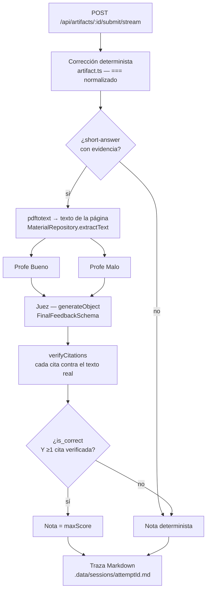

# My Favorite Teacher — tutor académico con panel de evaluación y citas verificables

Evolución del challenge de Proxus. El repo de partida era un tutor que lee PDFs, crea
artefactos de estudio (notas, quizzes, tests) y corrige intentos desde una UI web. Lo que
esta entrega añade es **cómo se corrige una respuesta corta**: un panel de tres agentes
cuya nota sólo puede subir si aporta una **cita literal verificada contra el texto real del
PDF**.

- **Stack**: pnpm workspaces, TypeScript, Effect v4 beta (`4.0.0-beta.83`), Effect HTTP
  API, Gemini, React 19 + Vite + Tailwind v4, Poppler para los PDFs.
- **Entrada rápida**: [Quickstart](#quickstart) · [Cómo probarlo a
  mano](#3-cómo-probarlo-manualmente) · [Dónde mirar para
  auditar](#dónde-mirar-para-auditar) · [Limitaciones conocidas](#limitaciones-conocidas)

---

## 1. Qué problema elegí

Las respuestas cortas se corregían por **igualdad exacta de strings normalizados**:

```ts
// packages/server/src/domain/artifacts/artifact.ts:207
const correct = normalizeAnswer(answer.answer) === normalizeAnswer(question.expectedAnswer);
```

Un alumno que escribe *"las plantas usan la luz del sol para fabricar su alimento"* cuando
se esperaba *"proceso por el que las plantas convierten la luz solar en energía química"*
saca un **cero**, con un feedback que se limita a repetir la respuesta esperada. Es
justamente el caso en el que un tutor sirve para algo, y es donde el producto se rendía.

El riesgo obvio de arreglarlo con un LLM es peor que el problema: un modelo que puntúa
respuestas **se inventa la justificación**. Dice "correcto, como explica la página 4" sobre
una página 4 que no dice eso. Un tutor que aprueba con argumentos falsos es menos útil que
uno estricto, porque el alumno no puede detectar el error.

Así que el problema real es doble: **corregir con criterio sin dejar que el modelo mienta.**

## 2. Cómo lo resolví

Un panel de tres agentes por pregunta, con la evidencia del PDF inyectada, y una regla
dura de arriba: **la nota sólo sube si el Juez dice `is_correct` Y al menos una de sus
citas se ha verificado literalmente contra el texto extraído del PDF.**



Las piezas, y dónde están:

| Pieza | Dónde | Qué hace |
|---|---|---|
| Evidencia | `domain/materials/material.ts` (`extractText`), `PdfService` | `pdftotext` sobre las páginas que la pregunta declara (`sourcePage`, o el `source` del artefacto). Sin evidencia, el panel no se llama. |
| Los dos profes | `domain/evaluation/engine.ts:74-80` | `Effect.all([bueno, malo], { concurrency: "unbounded", mode: "result" })`. Concurrentes, y **`mode: "result"` nunca falla**: si uno cae, el Juez recibe su crítica como no disponible y sigue. Degradación estructural, no `try/catch`. |
| El Juez | `domain/evaluation/engine.ts:103-115` | `LanguageModel.generateObject` con `FinalFeedbackSchema`. Salida estructurada nativa: `gemini.ts:236-241` manda `responseMimeType: "application/json"` + `responseSchema`. |
| Verificación de citas | `domain/materials/citation.ts` | Cada `cita_pdf` del Juez se busca literalmente (normalizada) en el texto de la página. Sale como `PdfCitation` con `verified` y su página, o `verified: false` sin página. |
| **La regla que lo cierra** | `domain/evaluation/review.ts:154-160` | `hasVerifiedCitation && is_correct` → `maxScore`; en cualquier otro caso, la nota determinista. |
| Transporte | `transport/http/server.ts:68-109` + `packages/web/src/lib/ndjson.ts` | NDJSON con fases discretas (`evaluating_good`, `evaluating_bad`, `deliberating`) y un `done` terminal siempre. El lector salta las líneas que no decodifican en vez de reventar. |
| Traza | `domain/evaluation/trace.ts`, `trace-format.ts` | Markdown por intento en `.data/sessions/<attemptId>.md`, escrito con `Effect.forkDetach` fuera del camino crítico. |

El resultado: una paráfrasis correcta y citable **sube la nota con la cita a la vista**;
una respuesta que el Juez aprueba sin poder citar **no la sube**, y la UI avisa de que la
evaluación es orientativa.

## 3. Cómo probarlo manualmente

### Requisitos

- Node.js 20+, `pnpm`.
- Poppler: `pdfinfo`, `pdftoppm` **y `pdftotext`**, los tres en el `PATH`.
- Una API key de Google Gemini (sólo para el flujo con LLM; los tests no la necesitan).

### Pasos

```bash
pnpm install
cp .env.example .env          # y rellena GOOGLE_GENERATIVE_AI_API_KEY
```

**Coloca un PDF con capa de texto** (apuntes exportados, no un escaneo) donde el server los
busca. Ese directorio **no existe en un checkout limpio** y sin él nada de la parte de
citas funciona:

```bash
mkdir -p packages/server/.data/materials/pdfs
cp ~/apuntes-biologia.pdf packages/server/.data/materials/pdfs/
```

El id del material es el nombre del fichero sin `.pdf`. También puedes subirlo desde la UI
arrastrándolo al sidebar.

```bash
pnpm run dev      # server :3000 + web :5173
```

Abre <http://localhost:5173> y:

1. Comprueba que el sidebar lista tu PDF entre los materiales.
2. Pídele al tutor: *"crea un test con tres preguntas de respuesta corta sobre la página 2
   de \<tu material\>"*.
3. Abre el artefacto en el workspace y responde: **una paráfrasis correcta** (con tus
   palabras, sin copiar), **una equivocada** y **una en blanco**. Envía.
4. Mientras evalúa verás el panel: **Profe Bueno** y **Profe Malo** activos a la vez,
   después **Juez deliberando**, y el contador *"Pregunta N de M"*.
5. En el resultado, por cada respuesta corta:
   - la **paráfrasis correcta** debería puntuar con el feedback del Juez y una cita
     marcada `verified` con su número de página. Abre el PDF por esa página y comprueba que
     el texto está ahí, literal;
   - una cita **no verificada** sale visualmente distinta, con *"Sin verificar en el PDF"* y
     **sin** número de página;
   - si ninguna cita se verificó, aparece el aviso *"Evaluación orientativa: no se pudo
     verificar ninguna cita, la nota es la automática."*.
6. Abre `packages/server/.data/sessions/<attemptId>.md` y contrasta: está todo lo que dijo
   cada profe, el JSON del Juez y la tabla de citas.

### Degradaciones que merece la pena provocar

| Provocación | Comportamiento esperado |
|---|---|
| `GEMINI_MODEL` apuntando a un modelo inexistente | Sale la corrección determinista, sin `review`, sin romper el layout. |
| PDF escaneado sin capa de texto | El panel no se llama; nota determinista y la traza lo deja escrito. |
| `pdftotext` fuera del `PATH` | El arranque falla rápido, con mensaje claro. |
| Endpoint de streaming caído | El envío sigue funcionando por la ruta tipada (`submitArtifactAttemptAction`), sin panel de progreso. |

El guion completo de QA está en [`docs/testing.md`](./docs/testing.md).

## 4. Qué checks ejecuté

Todos sobre este árbol, con sus resultados reales:

```bash
pnpm run typecheck        # ✅ los cuatro paquetes, sin errores
pnpm run test             # ✅ 15 ficheros, 137 tests (server 12/117, web 3/20)
pnpm --filter @proxus/web run build   # ✅ built in 599ms (aviso de chunk >500 kB, preexistente)
```

**`pnpm run test` no necesita `.env`, ni API key, ni red.** El `LanguageModel` y el
`MaterialRepository` son falsos: los tests fijan qué contesta el Juez y comprueban qué hace
el sistema con ello. Cubren, entre otras cosas:

- que una cita **inventada** no sube la nota, y que `citas_pdf: []` tampoco aunque el Juez
  diga `is_correct`;
- que un profe caído, los dos caídos, o un Juez que devuelve JSON malformado
  (`AiError.StructuredOutputError`) **no tumban nada**: degradan a la nota determinista;
- la frontera exacta de `MIN_QUOTE_LENGTH` en la verificación de citas;
- el purgado de schemas para Gemini, incluido el `$ref` cíclico;
- el lector NDJSON con un objeto JSON partido entre dos chunks y una línea que no decodifica;
- que el stream de evaluación termina **siempre** con un único frame `done`.

Además, la suite se ha comprobado **rompiéndola a propósito**: invalidando la condición
`hasVerifiedCitation` de `review.ts:155-159`, tres tests de `review.test.ts` se ponen en
rojo. Una suite que no puede ponerse roja no vale nada.

**Lo que NO pude verificar de forma automática**: nada que dependa de Gemini de verdad. La
eval con LLM real (`pnpm --filter @proxus/server run eval:tutor:artifact-authoring`) y el
`panel:check` requieren API key y gastan cuota; se han ejecutado a mano durante el
desarrollo, no forman parte de ningún check reproducible sin credenciales.

## 5. Qué haría después

1. **Sacar `panel:check` de lo manual.** Hoy la única señal sobre si los prompts son buenos
   es un script que hay que acordarse de lanzar. Con un dataset pequeño y anotado, más un
   presupuesto de coste, puede ser un check de PR.
2. **Citas por fragmento, no por página.** La unidad de evidencia es la página entera. Con
   chunking y offsets se podría resaltar la cita dentro del PDF en la UI, en vez de mandar
   al alumno a buscarla.
3. **Batching de preguntas.** Hoy se evalúa pregunta a pregunta: N preguntas son 3N
   llamadas. Agrupar por página bajaría coste y latencia, a costa de peor atribución cuando
   algo falla.
4. **Borrar el `===` de `artifact.ts:207`** una vez el panel tenga métricas de fiabilidad
   propias, y dejar la nota determinista sólo como suelo declarado.
5. **Streaming real de tokens** en el adaptador de Gemini (hoy `streamText` es
   `Stream.empty`), para que el chat deje de ser todo-o-nada.
6. **Unificar `AgentMessage`**, hoy duplicado entre `shared/schemas/agent-message.ts` y
   `domain/agents/harness/message.ts`.

---

## Trade-offs

Las decisiones incómodas, dichas en voz alta.

- **El scoring determinista sigue siendo la fuente de verdad; el panel va encima.** El
  panel sólo puede **subir** la nota, y sólo con una cita verificada. Es deliberado: un LLM
  que puede bajar notas convierte cada fallo del modelo en un agravio para el alumno. La
  degradación es estructural (`Effect.all` con `mode: "result"`, `Effect.match` sobre el
  motor), no un `try/catch` alrededor: **`reviewGradedAttempt` no puede fallar por tipo**.
- **El `===` de `artifact.ts:207` sobrevive** pese a que el ADR-01 pedía eliminarlo. Es la
  ruta de reserva cuando no hay evidencia, no hay API key, el PDF no tiene capa de texto o
  el panel cae. Borrarlo habría dejado el producto sin suelo justo en los casos en que más
  falta hace.
- **Se cita por página, no con RAG.** Ni chunking, ni embeddings, ni índice. Para un test
  generado desde páginas concretas, la página **es** el chunk relevante, y una cita se
  verifica igual de bien contra ella. Un índice vectorial habría añadido infraestructura,
  latencia y una fuente extra de error para resolver un problema que aquí no existe.
- **Se evalúa pregunta a pregunta**, aunque multiplique las llamadas (3 por respuesta
  corta). A cambio, el fallo de una pregunta no contamina a las demás, la traza es legible
  y el progreso se puede mostrar de verdad en la UI. Ver *Qué haría después*, punto 3.
- **No se construyó un servicio de structured output.** `LanguageModel.generateObject` ya
  existe en Effect v4 y concatena las partes de texto para decodificarlas con
  `Schema.fromJsonString`. Lo único que faltaba era que el adaptador honrase
  `responseFormat` (`gemini.ts:236-241`): ~15 líneas en vez de una capa nueva.
- **Se usa vitest pese a que `CHALLENGE.md` desaconseja frameworks nuevos.** El criterio de
  *"capacidad de evaluación"* se responde mucho mejor con 137 tests deterministas que
  corren sin API key que con un script Effect a mano, que ya no escalaba más allá de un
  dataset. El coste es una devDependency por paquete y ninguna línea de producción.

## Dónde mirar para auditar

**`packages/server/.data/sessions/<attemptId>.md`.** Es lo primero que conviene abrir.

Cada intento con respuestas cortas deja un Markdown con una sección por pregunta:

- enunciado, respuesta esperada y respuesta del alumno;
- **la evidencia exacta que se inyectó** (material, páginas, texto en blockquote, truncado
  a 1500 caracteres);
- lo que dijo **Profe Bueno** y **Profe Malo** —o *"No disponible: \<razón\>"* si cayeron—;
- el veredicto del **Juez** (`is_correct` y `feedback`), o su motivo de fallo;
- la **tabla de citas** con ✅/❌ y la página de cada una;
- nota determinista, nota final y si el panel la modificó, con cuántas citas verificadas.

Con eso se puede reconstruir cualquier decisión sin leer una línea de código, y comprobar
si una nota que subió lo hizo por una razón real.

## Limitaciones conocidas

Todas verificadas sobre este árbol.

- **No hay streaming de tokens**: `streamText` es `Stream.empty`
  (`domain/agents/gemini.ts:468`). Sólo hay estados discretos y mensajes completos.
- **Las rutas de streaming no salen en OpenAPI ni en el cliente tipado**
  (`transport/http/server.ts:68-109`). Se llaman con `fetch` a pelo desde
  `packages/web/src/domain/artifacts/attempt-stream.ts`.
- **PDFs escaneados sin capa de texto**: no se puede citar. El sistema lo detecta
  (`domain/evaluation/review.ts:120`) y degrada a la nota determinista, dejándolo escrito
  en la traza.
- **`AgentMessage` está duplicado** entre `packages/shared/src/schemas/agent-message.ts` y
  `packages/server/src/domain/agents/harness/message.ts`.
- **`toolParameters` (`domain/agents/gemini.ts:154-190`) hardcodea los esquemas JSON por
  nombre de tool**, con un `default` genérico. Añadir una tool al harness sin tocarlo la
  anuncia a Gemini con el esquema equivocado.
- **`packages/ai-google` es dependencia declarada del server y no la importa nadie.**
- **`ArtifactWorkspace` y `Sidebar` sólo tratan `onInitial`**: un refresco en segundo plano
  muestra datos viejos sin avisar.
- **El estado del chat sigue en cinco `useState`** dentro de
  `packages/web/src/domain/tutor/use-tutor-chat.ts`, no en atoms — a diferencia del
  workspace, que sí usa `evaluationRunAtom`
  (`packages/web/src/domain/artifacts/evaluation-atoms.ts:16-18`).
- **Los tests usan un `LanguageModel` falso: garantizan que ante una respuesta X el sistema
  hace Y, no que los prompts sean buenos.** Lo único que mide la calidad de los prompts es
  `panel:check` contra Gemini de verdad, y es manual.

---

## Quickstart

```bash
pnpm install
cp .env.example .env                  # edita GOOGLE_GENERATIVE_AI_API_KEY
mkdir -p packages/server/.data/materials/pdfs   # y copia ahí un PDF con capa de texto
pnpm run dev
```

- Web: <http://localhost:5173>
- API: <http://localhost:3000>
- Docs OpenAPI/Scalar: <http://localhost:3000/docs>
- OpenAPI JSON: <http://localhost:3000/openapi.json>

### Comandos

```bash
pnpm run typecheck                     # gate obligatorio
pnpm run test                          # vitest en server y web; sin API key, sin red
pnpm --filter @proxus/web run build
pnpm --filter @proxus/server run dev   # sólo backend

# requieren API key y gastan cuota
pnpm --filter @proxus/server run agent:tutor "lista mis materiales"
pnpm --filter @proxus/server run eval:tutor:artifact-authoring
pnpm --filter @proxus/server run panel:check
pnpm --filter @proxus/server run structured-output:check
```

## Estructura

```txt
packages/
  shared/      # Schemas y contratos HTTP compartidos entre server y web
  server/      # Backend Node + Effect: tutor agent, materiales, artifacts, panel de evaluación
  web/         # App React + proxy /api hacia el backend
  ai-google/   # Integración local con Gemini para Effect AI (hoy sin usar)

docs/                     # Documentación del template, actualizada
  getting-started.md · architecture.md · development.md · effect-primer.md
  ai-agent.md · api.md · testing.md · data.md · resources.md

documentacion/            # Documentación de esta entrega
  contexto-repo.md              # Arquitectura, comandos y trampas del repo
  funcionamiento-actual.md      # Cómo funciona el repo hoy, con ruta y línea
  adr-motor-evaluacion.md       # ADR-01: motor de evaluación y SSOT de schemas
  adr-02-evaluacion-transporte-observabilidad.md   # ADR-02: transporte y trazabilidad
  design-system.md              # Tokens de color y tipografía; norma para toda UI

planes/                   # Los planes de los PRs de esta entrega, PR-01 → PR-08
```

Notas de repo: `.data/` está ignorado por git y no existe en un checkout limpio; Tailwind v4
corre como plugin de Vite y `packages/web/src/styles.input.css` se importa directo desde
`main.tsx` (no hay paso de CSS aparte); los imports relativos llevan extensión `.ts`
(`rewriteRelativeImportExtensions`).
