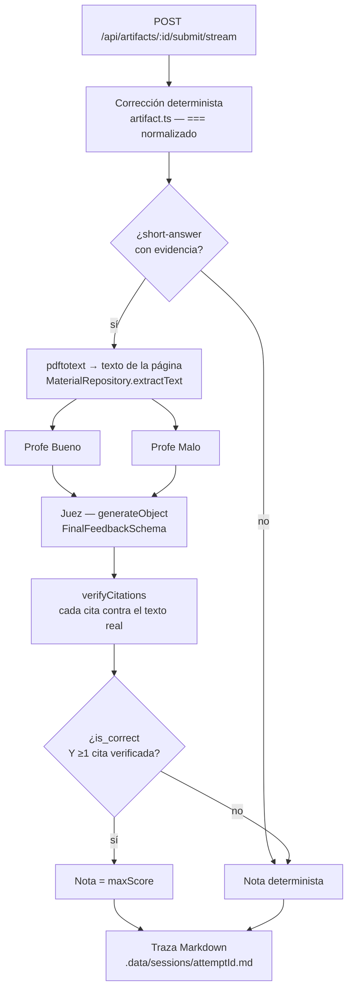

# My Favorite Teacher — tutor académico con panel de evaluación y citas verificables

Evolución de la prueba técnica de Proxus. El repo de partida era un tutor que lee PDFs, crea
artefactos de estudio (notas, quizzes, tests) y corrige intentos desde una UI web. Lo que
esta entrega añade es **cómo se corrige una respuesta corta**: un panel de tres agentes
cuya nota sólo puede subir si aporta una **cita literal verificada contra el texto real del
PDF**.

- **Stack**: pnpm workspaces, TypeScript, Effect v4 beta (`4.0.0-beta.83`), Effect HTTP
  API, Gemini, React 19 + Vite + Tailwind v4, Poppler para los PDFs.
- **Entrada rápida**: [Quickstart](#quickstart) · [Cómo probarlo a
  mano](#3-cómo-probarlo-manualmente) · [Dónde mirar para
  auditar](#dónde-mirar-para-auditar) · [Limitaciones conocidas](#limitaciones-conocidas)

## Índice

**Secciones**

- [0. El plan de actuación](#0-el-plan-de-actuación)
- [1. Qué problema elegí](#1-qué-problema-elegí)
- [2. Cómo lo resolví](#2-cómo-lo-resolví)
- [3. Cómo probarlo manualmente](#3-cómo-probarlo-manualmente)
- [4. Qué checks ejecuté](#4-qué-checks-ejecuté)
- [5. Qué haría después](#5-qué-haría-después)
- [6. Uso de la IA en el desarrollo](#6-uso-de-la-ia-en-el-desarrollo)
- [Trade-offs](#trade-offs)
- [Dónde mirar para auditar](#dónde-mirar-para-auditar)
- [Limitaciones conocidas](#limitaciones-conocidas)
- [Quickstart](#quickstart)
- [Estructura](#estructura)

**Documentos**

- [`docs/testing.md`](./docs/testing.md) — guion completo de QA
- [`documentacion/contexto-repo.md`](./documentacion/contexto-repo.md) — arquitectura, comandos y trampas del repo
- [`documentacion/funcionamiento-actual.md`](./documentacion/funcionamiento-actual.md) — cómo funciona el repo hoy, con ruta y línea
- [`documentacion/adr-motor-evaluacion.md`](./documentacion/adr-motor-evaluacion.md) — ADR-01: motor de evaluación y SSOT de schemas
- [`documentacion/adr-02-evaluacion-transporte-observabilidad.md`](./documentacion/adr-02-evaluacion-transporte-observabilidad.md) — ADR-02: transporte y trazabilidad
- [`documentacion/design-system.md`](./documentacion/design-system.md) — tokens de color y tipografía
- [`planes/plan.md`](./planes/plan.md) — plan general: tabla de PRs, estado y dependencias
- [`planes/GUIA-DOER.md`](./planes/GUIA-DOER.md) — entorno, orden de los PRs y trampas del repo

---

## 0. El plan de actuación

Antes de escribir código escribí el roadmap. Cada PR tiene su propio plan en
[`planes/`](./planes) —problema, pasos, criterio de aceptación y checks— y ninguno se
implementó sin ese plan delante. Los planes no se reescriben a posteriori: lo que se
torció queda anotado en su §Historial.

### Las fases

[`documentacion/tech-spec.md §6`](./documentacion/tech-spec.md) parte el desarrollo en
cuatro fases. Los ocho PRs del roadmap original se reparten así:

| Fase | Qué cubre | PRs |
|------|-----------|-----|
| 1 — Infraestructura y contratos | Los schemas viven una sola vez, en `packages/shared`, y el contrato del Juez existe antes que el Juez. | PR-01, PR-03 |
| 2 — Motor multi-agente | La evidencia del PDF y el panel de tres agentes concurrentes, aislado en el servidor. | PR-02, PR-04 |
| 3 — Observabilidad y UI | Transporte NDJSON con estados discretos, traza en disco y la UI que lo enseña. | PR-05, PR-06, PR-07 |
| 4 — Testing, evals y cierre | Suite de tests sin API key, evals y este README. | PR-08 |

**El reparto es mío, no de la spec.** La tech spec describe las cuatro fases por capa y por
acción, y nunca menciona PRs: la tabla de arriba es mi lectura, y hay al menos un caso
discutible. El PR-02 (`pdftotext`, enlace pregunta → página, verificador de citas) queda en
la fase 2 y no en la 1 porque la fase 1 está acotada explícitamente a la *capa shared*
(`packages/shared/src/schemas/`) mientras que el grueso del PR-02 es código de servidor, y
porque lo que produce —el texto real del PDF por página— es exactamente el insumo que la
fase 2 pide en su tercera acción: *«pasar los resultados al Agente Juez junto con los
chunks del PDF»*. Quien audite esto puede leerlo de otro modo; el criterio queda escrito
para que se vea cuál se usó.

Esa numeración cubre el roadmap, no el calendario: los ocho PRs de producto y de bugs que
se añadieron después (PR-1.5 y PR-09 → PR-13) se intercalaron entre la fase 1 y la fase 2,
porque casi todos desbloqueaban la QA manual de las fases siguientes.

### Los planes, uno por PR

En orden real de ejecución, no numérico.

**Fase 1 y hallazgos de la fase 1**

- **PR-01** — Una sola declaración de cada schema de artifact, en `shared`. Refactor sin cambio de comportamiento.
- **PR-1.5** — Tokens de color, tipografía Geist y tema claro: toda UI posterior nace ya repintada. Es el hallazgo de esta primera fase (ver abajo).

**Bugs y producto intercalados**

- **PR-12** — La sintaxis de tool call se fugaba al alumno como texto del asistente: observabilidad primero, red de seguridad después.
- **PR-12.1** — El PR-12 no cerró el bug: `finishReason` como señal fiable y reintento acotado dentro del adaptador.
- **PR-12.2** — Se quita la causa: las tool calls viajan como partes nativas y desaparecen las tres regex.
- **PR-09** — Subir PDFs desde la UI, en lugar de copiarlos a mano dentro de `.data/`.
- **PR-13** — Borrar materiales, cerrar el artefacto para recuperar el chat completo y renombrar el producto.
- **PR-10** — Ciclo de vida del input del chat: limpieza inmediata, bloqueo, botón Stop y reintento.
- **PR-11** — Latencia: el agente deja de encadenar herramientas para contestar lo evidente.

**Fases 2 a 4**

- **PR-02** — `pdftotext`, enlace pregunta → página y verificador de citas verbatim.
- **PR-03** — Contrato de evaluación en `shared` y modo JSON nativo en el adaptador de Gemini.
- **PR-04** — `EvaluationEngineService`: los tres agentes, concurrentes y aislados. Aquí está el producto.
- **PR-05** — Endpoint de streaming propio y lector NDJSON resiliente.
- **PR-06** — Traza auditable en Markdown, escrita fuera del camino crítico.
- **PR-07** — La UI enseña los tres agentes en vivo y las citas con su badge de verificación.
- **PR-08** — Cierre de la suite de tests, evals sin API key y este README.

### Por qué hay un PR-1.5

Con el PR-01 mergeado y antes de empezar la fase 2 me di cuenta de que faltaba una pieza
que el roadmap no contemplaba: sin una capa de tokens de color y tipografía, cada PR que
pintase UI —PR-09, PR-10, PR-07— habría que repintarlo después. Por eso lleva número
fraccionario: no es un PR extra al final de la lista, es un hallazgo de la primera fase que
se resolvió dentro de ella, justo detrás del PR-01. Queda anotado en el propio
[`planes/pr-01-ssot-schemas/plan.md`](./planes/pr-01-ssot-schemas/plan.md).

## 1. Qué problema elegí

Las respuestas cortas se corregían por **igualdad exacta de strings normalizados**:

```ts
// packages/server/src/domain/artifacts/artifact.ts:207
const correct = normalizeAnswer(answer.answer) === normalizeAnswer(question.expectedAnswer);
```

Un alumno que escribe *"las plantas usan la luz del sol para fabricar su alimento"* cuando
se esperaba *"proceso por el que las plantas convierten la luz solar en energía química"*
saca un **cero**, con un feedback que se limita a repetir la respuesta esperada. Es
justamente el caso en el que un tutor sirve para algo, y es donde el producto se rendía.

El riesgo obvio de arreglarlo con un LLM es peor que el problema: un modelo que puntúa
respuestas **se inventa la justificación**. Dice "correcto, como explica la página 4" sobre
una página 4 que no dice eso. Un tutor que aprueba con argumentos falsos es menos útil que
uno estricto, porque el alumno no puede detectar el error.

Así que el problema real es doble: **corregir con criterio sin dejar que el modelo mienta.**

A su vez durante el desarrollo se solventaron problemas como el funcionamiento de un botón de stop, el añadir o eliminar PDF, trazado de razonamiento, un leve cambio en el frontend para una paleta de colores más cercana a la de proxus, entre otros...

## 2. Cómo lo resolví

Un panel de tres agentes por pregunta, con la evidencia del PDF inyectada, y una regla
dura de arriba: **la nota sólo sube si el Juez dice `is_correct` Y al menos una de sus
citas se ha verificado literalmente contra el texto extraído del PDF.**



Las piezas, y dónde están:

| Pieza | Dónde | Qué hace |
|---|---|---|
| Evidencia | `domain/materials/material.ts` (`extractText`), `PdfService` | `pdftotext` sobre las páginas que la pregunta declara (`sourcePage`, o el `source` del artefacto). Sin evidencia, el panel no se llama. |
| Los dos profes | `domain/evaluation/engine.ts:74-80` | `Effect.all([bueno, malo], { concurrency: "unbounded", mode: "result" })`. Concurrentes, y **`mode: "result"` nunca falla**: si uno cae, el Juez recibe su crítica como no disponible y sigue. Degradación estructural, no `try/catch`. |
| El Juez | `domain/evaluation/engine.ts:103-115` | `LanguageModel.generateObject` con `FinalFeedbackSchema`. Salida estructurada nativa: `gemini.ts:242-247` manda `responseMimeType: "application/json"` + `responseSchema`. |
| Verificación de citas | `domain/materials/citation.ts` | Cada `cita_pdf` del Juez se busca literalmente (normalizada) en el texto de la página. Sale como `PdfCitation` con `verified` y su página, o `verified: false` sin página. |
| **La regla que lo cierra** | `domain/evaluation/review.ts:72-76` (`panelRaisesScore`), aplicada en `review.ts:164` | `is_correct` **y** al menos una cita `verified` → `maxScore`; en cualquier otro caso, la nota determinista. La regla se exporta para que `panel:check` informe exactamente lo mismo que aplica el motor. |
| Transporte | `transport/http/server.ts:68-109` + `packages/web/src/lib/ndjson.ts` | NDJSON con fases discretas (`evaluating_good`, `evaluating_bad`, `deliberating`) y un `done` terminal siempre. El lector salta las líneas que no decodifican en vez de reventar. |
| Traza | `domain/evaluation/trace.ts`, `trace-format.ts` | Markdown por intento en `.data/sessions/<attemptId>.md`, escrito con `Effect.forkDetach` fuera del camino crítico. |

El resultado: una paráfrasis correcta y citable **sube la nota con la cita a la vista**;
una respuesta que el Juez aprueba sin poder citar **no la sube**, y la UI avisa de que la
evaluación es orientativa.

## 3. Cómo probarlo manualmente

### Requisitos

- **Node.js ≥ 22.18** (vitest 5 exige `^22.12 || ^24 || >=26`, y los scripts CLI usan
  `import.meta.main`, disponible desde 22.18). Verificado sobre Node 22.22.2.
- `pnpm` 10 (el repo pinea `pnpm@10.23.0` en `packageManager`).
- Poppler: `pdfinfo`, `pdftoppm` **y `pdftotext`**, los tres en el `PATH`.
  Debian/Ubuntu `apt install poppler-utils` · Fedora `dnf install poppler-utils` ·
  macOS `brew install poppler`.
- Una API key de Google Gemini (sólo para el flujo con LLM y yo personalmente uso 3.6 flash; los tests no la necesitan).

### Pasos

```bash
pnpm install
cp .env.example .env          # y rellena GOOGLE_GENERATIVE_AI_API_KEY
```

`.env.example` trae `GEMINI_MODEL=gemini-3.6-flash`. Ojo con esa variable: apuntar a un
modelo retirado (`gemini-2.5-flash` ya devuelve **404 "no longer available to new users"**)
degrada todo el panel a la nota determinista sin que nada más se rompa — es el mismo
comportamiento que la tabla de degradaciones de más abajo.

**Coloca un PDF con capa de texto** (apuntes exportados, no un escaneo) donde el server los
busca. Ese directorio **no existe en un checkout limpio** y sin él nada de la parte de
citas funciona:

```bash
mkdir -p packages/server/.data/materials/pdfs
cp ~/apuntes-biologia.pdf packages/server/.data/materials/pdfs/
```

El id del material es el nombre del fichero sin `.pdf`. También puedes subirlo desde la UI
arrastrándolo al sidebar.

```bash
pnpm run dev      # server :3000 + web :5173
```

Abre <http://localhost:5173> y:

1. Comprueba que el sidebar lista tu PDF entre los materiales.
2. Pídele al tutor: *"crea un test con tres preguntas de respuesta corta sobre la página 2
   de \<tu material\>"*.
3. Abre el artefacto en el workspace y responde: **una paráfrasis correcta** (con tus
   palabras, sin copiar), **una equivocada** y **una en blanco**. Envía.
4. Mientras evalúa verás el panel: **Profe Bueno** y **Profe Malo** activos a la vez,
   después **Juez deliberando**, y el contador *"Pregunta N de M"*.
5. En el resultado, por cada respuesta corta:
   - la **paráfrasis correcta** debería puntuar con el feedback del Juez y una cita
     marcada `verified` con su número de página. Abre el PDF por esa página y comprueba que
     el texto está ahí, literal;
   - una cita **no verificada** sale visualmente distinta, con *"Sin verificar en el PDF"* y
     **sin** número de página;
   - si ninguna cita se verificó, aparece el aviso *"Evaluación orientativa: no se pudo
     verificar ninguna cita, la nota es la automática."*.
6. Abre `packages/server/.data/sessions/<attemptId>.md` y contrasta: está todo lo que dijo
   cada profe, el JSON del Juez y la tabla de citas.

### Degradaciones que merece la pena provocar

| Provocación | Comportamiento esperado |
|---|---|
| `GEMINI_MODEL` apuntando a un modelo inexistente | Sale la corrección determinista, sin `review`, sin romper el layout. |
| PDF escaneado sin capa de texto | El panel no se llama; nota determinista y la traza lo deja escrito. |
| `pdftotext` fuera del `PATH` | El arranque falla rápido, con mensaje claro. |
| Endpoint de streaming caído | El envío sigue funcionando por la ruta tipada (`submitArtifactAttemptAction`), sin panel de progreso. |

El guion completo de QA está en [`docs/testing.md`](./docs/testing.md).

## 4. Qué checks ejecuté

Todos sobre este árbol, con sus resultados reales:

```bash
pnpm run typecheck        # los cuatro paquetes, sin errores
pnpm run test             # 17 ficheros, 151 tests (server 14/131, web 3/20)
pnpm --filter @proxus/web run build   # ~0,6 s (aviso de chunk >500 kB, preexistente)
```

**`pnpm run test` no necesita `.env`, ni API key, ni red.** El `LanguageModel` y el
`MaterialRepository` son falsos: los tests fijan qué contesta el Juez y comprueban qué hace
el sistema con ello. Cubren, entre otras cosas:

- que una cita **inventada** no sube la nota, y que `citas_pdf: []` tampoco aunque el Juez
  diga `is_correct`;
- que un profe caído, los dos caídos, o un Juez que devuelve JSON malformado
  (`AiError.StructuredOutputError`) **no tumban nada**: degradan a la nota determinista;
- la frontera exacta de `MIN_QUOTE_LENGTH` en la verificación de citas;
- el purgado de schemas para Gemini, incluido el `$ref` cíclico;
- el lector NDJSON con un objeto JSON partido entre dos chunks y una línea que no decodifica;
- que el stream de evaluación termina **siempre** con un único frame `done`;
- que al agotarse el presupuesto de pasos del agente **nunca** sale un tool result crudo por
  boca del tutor (`session-step-budget.test.ts`, 4 casos);
- que el schema de artifacts acepta lo que la skill documenta y rechaza lo que no
  (`artifact-schema.test.ts`, 5 casos).

Además, la suite se ha comprobado **rompiéndola a propósito**: relajando
`panelRaisesScore` (`review.ts:72-76`) para que la nota suba con `is_correct` a secas
—es decir, quitando la exigencia de cita `verified`— se ponen en rojo **exactamente 5
tests**, todos en `review.test.ts`. Cifra comprobada ejecutando `npm test` con la mutación
puesta (5 failed | 126 passed) y revirtiéndola después (151/151 en verde):

- `reviewGradedAttempt › does NOT raise the grade when the citation is
  invented/unverifiable against the real text`
- `reviewGradedAttempt › does NOT raise the grade when the panel says is_correct but the
  citation is unverified`
- `reviewGradedAttempt › does NOT raise the grade when the panel says is_correct but cites
  nothing at all (citas_pdf: [])`
- `panelRaisesScore › does NOT raise the score when the judge says correct but no citation
  is verified`
- `panelRaisesScore › does NOT raise the score when the judge says correct but cites
  nothing`

Los otros tres casos de `describe("panelRaisesScore")` siguen verdes, y así debe ser:
cubren la dirección contraria de la regla (correcta + cita verificada **sí** sube;
incorrecta con cita verificada no sube; sin panel no sube), que la mutación no toca.
Una suite que no puede ponerse roja no vale nada.

### Checks contra Gemini de verdad

Los tres scripts que llaman al modelo real (`eval:tutor:artifact-authoring`,
`structured-output:check` y `panel:check`) necesitan API key y gastan cuota, así que **no
forman parte de ningún check reproducible sin credenciales** y no entran en `pnpm run
test`. Los ejecuté a mano contra `gemini-3.6-flash`:

| Script | Resultado |
|---|---|
| `structured-output:check` | Verde: `generateObject` devolvió JSON válido contra `FinalFeedbackSchema`. |
| `eval:tutor:artifact-authoring` | **3/3 casos, 9/9 criterios** (`creates-note`, `creates-quiz`, `creates-test`): tipo de artefacto correcto, número de preguntas correcto, artefacto mencionado en la respuesta y cero tool results fallidos. Es la primera evidencia con modelo real de que el arreglo de la fuga de tool calls (PR-12) aguanta. |
| `panel:check` | Dos pasadas de punta a punta, una por cada dirección de la regla. Detalle abajo. |

Las dos pasadas de `panel:check` dejaron su traza en `packages/server/.data/sessions/`
(directorio gitignorado: sólo existe en la máquina donde se ejecutó):

- **`panel-check-1788895344615.md`** — respuesta del alumno correcta en abstracto (*"la
  media es 4"*) pero **no sostenida por la página inyectada**. El Juez devolvió
  `is_correct: false` explicando que esa página sólo trata visualización de datos, y **la
  nota no subió**.
- **`panel-check-1788895812699.md`** — respuesta anclada en el material (el orden
  Matplotlib → Seaborn → Plotly): `is_correct: true` y una cita `verified: true` con la
  frase literal *"Aprende primero Matplotlib (la base), luego Seaborn (el atajo elegante)
  y finalmente Plotly (la interactividad)."*, página 2 de `guiaMuestraDeDatos`. La traza
  cierra con `Nota determinista: 0` / `Nota final: 1` / `Nota modificada por el panel: sí
  (1 cita verificada)`.

En las dos pasadas los dos profes discreparon de verdad y el Juez arbitró, en vez de
limitarse a firmar la crítica del Profe Bueno. Con eso, **la afirmación central de esta
entrega —la nota sólo sube con una cita verificada contra el PDF real— tiene evidencia con
el modelo en vivo, en las dos direcciones.**

El coste de esa evidencia: el *free tier* de Gemini da **20 peticiones al día y por
modelo**, y los tres scripts juntos gastan ~19-20. No caben dos rondas completas el mismo
día, y no hay modelo de reserva sobre el que repartir la cuota (ver *Limitaciones
conocidas*). El guion para repetirlos está en [`docs/testing.md`](./docs/testing.md).

### Tres bugs que cazó la QA final

La QA manual de cierre —la de *Cómo probarlo manualmente*, con un PDF real y el modelo en
vivo— destapó tres fallos que ninguna suite anterior veía. Los tres están arreglados en esta
rama, y los tres llevan test:

**1. El volcado de una página del PDF llegaba al alumno como si fuera la respuesta del
tutor.** El bucle del agente (`domain/agents/harness/session.ts`) guardaba el último tool
result en una variable y, al agotarse `maxSteps`, lo devolvía tal cual como mensaje del
asistente. El alumno veía el texto crudo de la página —encabezados
`--- <materialId> page 4 ---` incluidos, tal y como los emite `materials text`
(`material-commands.ts:89-90`)— firmado por el tutor. Un tool result es fontanería interna, nunca una
respuesta. El arreglo tiene dos mitades:

- se borra esa variable y, cuando el presupuesto se agota, el harness gasta **un turno más
  con las herramientas apagadas** (`toolChoice: "none"`) para obligar al modelo a redactar
  una respuesta de verdad con lo que ya reunió; si ese turno también falla, sale un mensaje
  honesto de "me quedé sin pasos", nunca el volcado;
- para que apagarlas signifique algo, el adaptador de Gemini tenía que decirlo: omitir
  `toolConfig` deja al modelo en `AUTO`, así que `toolChoice: "none"` ahora manda
  `{ mode: "NONE" }` explícito (`domain/agents/gemini.ts`).

De paso, la causa de que el presupuesto se agotara: el PR-11 bajó `maxSteps` de 8 a 4 por
latencia, y un flujo con materiales no cabe en 4 (dos `load_skill`, uno o dos `materials
text` y un `artifacts create` antes de escribir una sola línea). Vuelve a 8 en las dos
puertas de entrada del tutor (`tutor-chat-service.ts` y `academic-tutor.ts`), que además
habían quedado descuadradas entre sí.

Test: `packages/server/src/domain/agents/harness/__tests__/session-step-budget.test.ts`
—4 casos con un `LanguageModel` falso que guioniza cuatro turnos que sólo llaman
herramientas: comprueba que el volcado no sale, que se gasta exactamente un turno extra con
`toolChoice: "none"`, que el fallo de ese turno degrada a un mensaje honesto, y que un turno
que sí termina dentro del presupuesto no paga ese coste.

**2. El modelo adivinaba el schema de artifacts y el alumno veía un `SchemaError`.** Ni la
skill `create-study-artifacts` ni el `--help` de `artifacts create` documentaban el tipo
`short-answer` (que usa `expectedAnswer`, no `correctAnswer`, y sólo existe en un `test`)
ni que `explanation` es obligatoria en las preguntas cerradas. El modelo lo inventaba, la
validación lo rechazaba y el error de schema acababa en pantalla. El arreglo es
documentación en los tres sitios donde el modelo mira —skill, `--help` y el mensaje de
error de validación, que ahora enumera los campos requeridos por tipo de pregunta— más un
cambio de schema: `maxScore` de `short-answer` pasa a ser opcional con **valor por defecto
1** al decodificar (`packages/shared/src/schemas/artifact.ts`), porque todos los llamantes
repetían la misma constante y las preguntas cerradas ya valen 1 punto fijo.

Test: `packages/server/src/domain/artifacts/__tests__/artifact-schema.test.ts` —5 casos:
que `maxScore` se rellena a 1 cuando falta y se respeta cuando viene, que un `test` con
`short-answer` sin `maxScore` decodifica, que una pregunta cerrada sin `explanation`
**se rechaza**, y que un `test` con los tres tipos de pregunta tal y como los documenta la
skill decodifica entero. Ese último caso es el que ata la documentación al schema: si la
skill y el schema se separan, se pone rojo.

**3. La traza de `panel:check` anunciaba subidas de nota que el motor no aplica.** El script
de demo calculaba `finalScore` y `scoreOverridden` a partir de `is_correct` a secas,
reimplementando por su cuenta una regla que el motor tiene más estricta: la nota sólo sube
si el Juez la da por correcta **y** al menos una cita quedó `verified`. Una demo que dice
"nota modificada por el panel" cuando el producto no la habría modificado es peor que no
tener demo. El arreglo no es parchear el script: la regla se extrae a `panelRaisesScore`
(`domain/evaluation/review.ts:72-76`), el motor la usa (`review.ts:164`) y el script la
importa, así que no pueden volver a divergir.

Test: `packages/server/src/domain/evaluation/__tests__/review.test.ts` gana un
`describe("panelRaisesScore")` con 5 casos —correcta + cita verificada sube; correcta con
cita sin verificar no sube; correcta sin citas no sube; incorrecta con cita verificada no
sube; sin panel no sube—. Se prueba la función directamente porque `panel.check.ts` es un
ejecutable con `argv` y no se puede invocar desde vitest.

## 5. Qué haría después

1. **Visualizador de PDF integrado, con las citas enlazadas a su página.** Es la pieza que
   más echo de menos, y la que más barata sale por lo que ya hay construido. Hoy el alumno
   **sube el PDF pero no puede verlo dentro de la app**: la única superficie que existe es
   el uploader del sidebar y una lista de materiales con su título y su número de páginas.
   Cuando el Juez le devuelve una cita verificada, la UI la enseña como texto entrecomillado
   con un `✅ Verificada · <material> · pág. 2`
   (`packages/web/src/components/evaluation/CitationList.tsx`) y ahí se acaba: para
   comprobarla hay que salir de la plataforma, abrir el PDF por su cuenta e ir a esa página
   a mano. El propio guion de QA lo admite —*"contrástala abriendo el PDF por esa página"*
   ([`docs/testing.md`](./docs/testing.md))—, lo cual es exactamente el gesto que esta
   entrega quería eliminar: la evidencia se verifica en el servidor, pero el alumno todavía
   tiene que fiarse de mi palabra.

   Lo que haría: un **visor embebido junto al chat y al workspace**, con navegación de
   páginas (anterior/siguiente y salto directo a una página), y **cada cita verificada
   convertida en un enlace que abre el visor en su página exacta**. El dato ya existe y es
   de primera clase: `PdfCitation` guarda `materialId`, `page`, `quote` y `verified`
   (`packages/shared/src/schemas/citation.ts:3-9`), la traza en disco ya imprime esa página
   en su tabla de citas, y `PdfMaterial` trae `pageCount`
   (`packages/shared/src/schemas/material.ts:3-9`), que es justo lo que necesita un
   paginador para acotarse. Es decir: no hay que inventar el enlace pregunta → página, sólo
   **dejar de tirarlo**.

   Lo que falta es una sola cosa, y conviene decirlo sin adornos: **hoy ningún endpoint
   sirve el PDF al navegador.** La `MaterialsApi`
   (`packages/shared/src/api/materials.ts`) expone `list`, `get` (metadatos: id, título,
   nombre de fichero, páginas, fecha), `upload` y `delete`, y nada más; los bytes viven en
   `packages/server/.data/materials/pdfs/` y sólo los tocan el agente y el motor. Las dos
   salidas razonables ya están medio construidas en el server:

   - servir el fichero tal cual en un `GET /api/materials/:id/file` y pintarlo en el cliente
     con `pdf.js` — resolviendo la ruta con el `getFile` del repositorio, que es el que
     evita el *path traversal* (`infra/materials/file-material-repository.ts:59`, con el
     motivo escrito en `:115-116`), no concatenando el id;
   - o servir **imágenes de página** reutilizando `renderPages`, que ya existe, ya valida
     que la página esté dentro de `1..pageCount` y ya renderiza con `pdftoppm`
     (`infra/materials/poppler-pdf-service.ts`) — misma dependencia de Poppler que el
     proyecto ya exige al arrancar, cero librerías nuevas en el cliente, a cambio de
     latencia por página y de perder el texto seleccionable.

   El paso siguiente natural, una vez hay visor, es el punto 4: con offsets de fragmento se
   puede **resaltar la cita dentro de la página**, no sólo abrirla.
2. **Sacar `panel:check` de lo manual.** Hoy la única señal sobre si los prompts son buenos
   es un script que hay que acordarse de lanzar. Con un dataset pequeño y anotado, más un
   presupuesto de coste, puede ser un check de PR.
3. **Memoria persistente entre sesiones (inspirada en Engram).** Un sistema ligero de
   almacenamiento local basado en ficheros Markdown, indexados por fecha y temática de
   exámenes. Diseñado para que alumnos que afrontan recuperaciones o arrastran suspensos
   conserven el contexto histórico de su progreso sin reiniciar la conversación con el
   agente desde cero. Es la misma idea que ya usa la traza de auditoría en
   `.data/sessions/<attemptId>.md` (ver *Dónde mirar para auditar*), aplicada a la memoria
   de sesión en vez de al intento: no hace falta infraestructura nueva, sólo el mismo
   patrón de ficheros Markdown planos — manteniendo una base de datos documental limpia y
   tratable, sin añadir la complejidad de motores relacionales pesados.
4. **Citas por fragmento, no por página.** La unidad de evidencia es la página entera. Con
   chunking y offsets se podría **resaltar** la cita dentro de la página, en vez de dejar al
   alumno buscándola a ojo. Sólo tiene sentido encima del punto 1: sin visor no hay dónde
   resaltar.
5. **Batching de preguntas.** Hoy se evalúa pregunta a pregunta: N preguntas son 3N
   llamadas. Agrupar por página bajaría coste y latencia, a costa de peor atribución cuando
   algo falla.
6. **Derivar `toolParameters` del toolkit en vez de hardcodearlo.**
   `domain/agents/gemini.ts:154-184` mapea a mano los esquemas JSON de parámetros por
   **nombre** de tool, con un `default` heredado del agente de sumas de ejemplo. Es una
   trampa silenciosa: añadir una tool al harness sin acordarse de ese `switch` la anuncia a
   Gemini con el esquema equivocado, y el fallo aparece lejos, como un tool call malformado.
   Los `AgentToolkit` ya llevan sus `Schema` dentro; generarlos desde ahí con la misma
   tubería que ya usa `generateObject` (`Schema.toJsonSchemaDocument` + `toGeminiResponseSchema`,
   `domain/agents/gemini-schema.ts`) cierra el agujero y borra el `default`.
7. **Instrumentar el presupuesto de pasos.** El arreglo de esta entrega convierte el
   agotamiento de `maxSteps` en un turno de cierre honesto y deja un log `agent.wrap_up`,
   pero nadie lo mira. Contar cuántos turnos acaban ahí es la señal que dice si `maxSteps: 8`
   es el número correcto —hoy elegido a mano, después de que el PR-11 lo bajara a 4 y
   rompiera los flujos con materiales— y si conviene un presupuesto distinto para el chat
   corto y para la creación de artefactos.
8. **Preguntas de respuesta múltiple.** El schema sólo admite una opción correcta
   (`correctOptionId`, uno), hasta el punto de que la skill le dice al modelo que, si el
   alumno pide varias respuestas válidas, lo modele como `short-answer` o lo parta en varias
   preguntas. Es un rodeo declarado, no un diseño: un tipo `multi-select` con su corrección
   determinista (acierto total, parcial o nulo) es un miembro más de la unión de
   `packages/shared/src/schemas/artifact.ts` y de `gradeAttempt`.
9. **Borrar el `===` de `artifact.ts:207`** una vez el panel tenga métricas de fiabilidad
   propias, y dejar la nota determinista sólo como suelo declarado.
10. **Streaming real de tokens** en el adaptador de Gemini (hoy `streamText` es
    `Stream.empty`), para que el chat deje de ser todo-o-nada.
11. **Unificar `AgentMessage`**, hoy duplicado entre `shared/schemas/agent-message.ts` y
    `domain/agents/harness/message.ts`.
12. **Quitar las dos llamadas duplicadas de `panel:check`.** El script repite las llamadas
    al Profe Bueno y al Profe Malo *fuera* del motor sólo para poder imprimirlas
    (`domain/evaluation/panel.check.ts:46-64`), encima de las tres que ya hace el motor: 5
    llamadas donde bastan 3. Con un límite de 20 peticiones al día eso es un tercio de la
    cuota tirado en cada pasada. El arreglo bueno no es tocar el script, sino que el motor
    exponga las críticas intermedias en su resultado — hoy no lo hace, y el propio comentario
    del fichero lo admite.

---
## 6. Uso de la IA en el desarrollo

En el desarrollo del proyecto se ha utilizado IA generativa mediante el uso de agentes de código para acelerar el proceso del código, tanto para entender el proyecto más rápido, como para escribirlo.

La IA no se ha utilizado sin criterio, en todo momento se ha utilizado una filosofía personal que yo llamo Centuar Programing.

El desarrollo se conduce principalmente mediante instrucciones en lenguaje natural (Speech-Driven Development), con la IA operando como ejecutor subordinado bajo supervisión continua del humano (Human-in-the-Loop). El humano define la intención y valida el resultado en cada punto de control relevante; la IA acelera la ejecución sin asumir el control estratégico.

El objetivo es establecer una simbiosis controlada entre humano e IA mediante skills, harness, MCP's, etc...

Además de crear un sistema de Thinker (Opus)- Doer (Sonnet) mediante la elaboración de planes de actuación por secciones. (Se delegan manualmente las tareas a sub agentes por terminal y estos a su vez fragmentan la tarea en sub agentes que lanzan ellos).

El testing automatico, la redacción de pr y commits, y documentación y REDACCIÓN de los planes.md se delegó por completo a la IA.

**ESTO NO SIGNIFICA QUE NO HAYA IDEADO Y DESARROLLADO YO LOS PLANES**

---

## Trade-offs

Las decisiones incómodas, dichas en voz alta.

- **El scoring determinista sigue siendo la fuente de verdad; el panel va encima.** El
  panel sólo puede **subir** la nota, y sólo con una cita verificada. Es deliberado: un LLM
  que puede bajar notas convierte cada fallo del modelo en un agravio para el alumno. La
  degradación es estructural (`Effect.all` con `mode: "result"`, `Effect.match` sobre el
  motor), no un `try/catch` alrededor: **`reviewGradedAttempt` no puede fallar por tipo**.
- **El `===` de `artifact.ts:207` sobrevive** pese a que el ADR-01 pedía eliminarlo. Es la
  ruta de reserva cuando no hay evidencia, no hay API key, el PDF no tiene capa de texto o
  el panel cae. Borrarlo habría dejado el producto sin suelo justo en los casos en que más
  falta hace.
- **Se cita por página, no con RAG.** Ni chunking, ni embeddings, ni índice. Para un test
  generado desde páginas concretas, la página **es** el chunk relevante, y una cita se
  verifica igual de bien contra ella. Un índice vectorial habría añadido infraestructura,
  latencia y una fuente extra de error para resolver un problema que aquí no existe.
- **Se evalúa pregunta a pregunta**, aunque multiplique las llamadas (3 por respuesta
  corta). A cambio, el fallo de una pregunta no contamina a las demás, la traza es legible
  y el progreso se puede mostrar de verdad en la UI. Ver *Qué haría después*, punto 5.
- **No se construyó un servicio de structured output.** `LanguageModel.generateObject` ya
  existe en Effect v4 y concatena las partes de texto para decodificarlas con
  `Schema.fromJsonString`. Lo único que faltaba era que el adaptador honrase
  `responseFormat` (`gemini.ts:242-247`): ~15 líneas en vez de una capa nueva.
- **Se usa vitest pese a que `CHALLENGE.md` desaconseja frameworks nuevos.** El criterio de
  *"capacidad de evaluación"* se responde mucho mejor con 151 tests deterministas que
  corren sin API key que con un script Effect a mano, que ya no escalaba más allá de un
  dataset. El coste es una devDependency por paquete y ninguna línea de producción.

## Dónde mirar para auditar

**`packages/server/.data/sessions/<attemptId>.md`.** Es lo primero que conviene abrir.

Cada intento con respuestas cortas deja un Markdown con una sección por pregunta:

- enunciado, respuesta esperada y respuesta del alumno;
- **la evidencia exacta que se inyectó** (material, páginas, texto en blockquote, truncado
  a 1500 caracteres);
- lo que dijo **Profe Bueno** y **Profe Malo** —o *"No disponible: \<razón\>"* si cayeron—;
- el veredicto del **Juez** (`is_correct` y `feedback`), o su motivo de fallo;
- la **tabla de citas** con ✅/❌ y la página de cada una;
- nota determinista, nota final y si el panel la modificó, con cuántas citas verificadas.

Con eso se puede reconstruir cualquier decisión sin leer una línea de código, y comprobar
si una nota que subió lo hizo por una razón real.

`panel:check` deja el mismo formato de traza sin necesidad de levantar la app, en
`packages/server/.data/sessions/panel-check-<timestamp>.md`. Las dos pasadas que
documento en *Qué checks ejecuté* (`panel-check-1788895344615.md` y
`panel-check-1788895812699.md`) son exactamente eso: la nota que no sube y la nota que
sube, cada una con su tabla de citas. Como `.data/` está gitignorado, no viajan con el
repo — para reproducirlas hay que volver a lanzar el script.

## Limitaciones conocidas

Todas verificadas sobre este árbol.

- **No hay streaming de tokens**: `streamText` es `Stream.empty`
  (`domain/agents/gemini.ts:474`). Sólo hay estados discretos y mensajes completos.
- **El PDF no se puede ver dentro de la app.** El alumno lo sube y la UI le enseña título y
  número de páginas, nada más: `MaterialsApi` (`packages/shared/src/api/materials.ts`) no
  tiene ningún endpoint que devuelva el fichero ni imágenes de página al navegador. Una cita
  verificada se muestra con su número de página, pero para contrastarla hay que abrir el PDF
  fuera de la plataforma. Es la primera cosa que arreglaría (*Qué haría después*, punto 1).
- **Las rutas de streaming no salen en OpenAPI ni en el cliente tipado**
  (`transport/http/server.ts:68-109`). Se llaman con `fetch` a pelo desde
  `packages/web/src/domain/artifacts/attempt-stream.ts`.
- **PDFs escaneados sin capa de texto**: no se puede citar. El sistema lo detecta
  (`domain/evaluation/review.ts:113-129`) y degrada a la nota determinista, dejándolo escrito
  en la traza.
- **`AgentMessage` está duplicado** entre `packages/shared/src/schemas/agent-message.ts` y
  `packages/server/src/domain/agents/harness/message.ts`.
- **`toolParameters` (`domain/agents/gemini.ts:154-184`) hardcodea los esquemas JSON por
  nombre de tool**, con un `default` genérico. Añadir una tool al harness sin tocarlo la
  anuncia a Gemini con el esquema equivocado.
- **`packages/ai-google` es dependencia declarada del server y no la importa nadie.**
- **`ArtifactWorkspace` y `Sidebar` sólo tratan `onInitial`**: un refresco en segundo plano
  muestra datos viejos sin avisar.
- **El estado del chat sigue en cinco `useState`** dentro de
  `packages/web/src/domain/tutor/use-tutor-chat.ts`, no en atoms — a diferencia del
  workspace, que sí usa `evaluationRunAtom`
  (`packages/web/src/domain/artifacts/evaluation-atoms.ts:16-18`).
- **Los tests usan un `LanguageModel` falso: garantizan que ante una respuesta X el sistema
  hace Y, no que los prompts sean buenos.** Lo único que mide la calidad de los prompts es
  `panel:check` contra Gemini de verdad, y sigue siendo manual: ejecutado a mano, con los
  resultados de *Qué checks ejecuté*, no en cada PR.
- **`gemini-3.6-flash` es el único modelo de texto disponible para esta key.**
  `gemini-2.5-flash` responde **404** (*"no longer available to new users. Please update
  your code to use models/gemini-3.6-flash"*), y también dan 404 `gemini-3.5-flash`,
  `gemini-3.5-flash-lite`, `gemini-3.1-flash-lite` y `flash-latest`. No hay modelo de
  reserva sobre el que repartir cuota ni al que degradar.
- **Cuota del *free tier*: 20 peticiones al día y por modelo.** Los tres scripts con LLM
  real gastan ~19-20 entre los tres, así que no se pueden repetir dos veces el mismo día.
  Y `panel:check` gasta 5 llamadas donde bastarían 3
  (`domain/evaluation/panel.check.ts:46-64` repite a los dos profes fuera del motor sólo
  para imprimir sus críticas).

---

## Quickstart

```bash
pnpm install
cp .env.example .env                  # edita GOOGLE_GENERATIVE_AI_API_KEY
mkdir -p packages/server/.data/materials/pdfs   # y copia ahí un PDF con capa de texto
pnpm run dev
```

- Web: <http://localhost:5173>
- API: <http://localhost:3000>
- Docs OpenAPI/Scalar: <http://localhost:3000/docs>
- OpenAPI JSON: <http://localhost:3000/openapi.json>

### Comandos

```bash
pnpm run typecheck                     # gate obligatorio
pnpm run test                          # vitest en server y web; sin API key, sin red
pnpm --filter @proxus/web run build
pnpm --filter @proxus/server run dev   # sólo backend

# requieren API key y gastan cuota
pnpm --filter @proxus/server run agent:tutor "lista mis materiales"
pnpm --filter @proxus/server run eval:tutor:artifact-authoring
pnpm --filter @proxus/server run structured-output:check

# el panel entero sobre un PDF real, sin levantar la app:
#   panel:check <respuestaAlumno> <respuestaEsperada> <materialId> <página>
pnpm --filter @proxus/server run panel:check \
  "respuesta del alumno" "respuesta esperada" mi-material 2
```

## Estructura

```txt
packages/
  shared/      # Schemas y contratos HTTP compartidos entre server y web
  server/      # Backend Node + Effect: tutor agent, materiales, artifacts, panel de evaluación
  web/         # App React + proxy /api hacia el backend
  ai-google/   # Integración local con Gemini para Effect AI (hoy sin usar)

docs/                     # Documentación del template, actualizada
  getting-started.md · architecture.md · development.md · effect-primer.md
  ai-agent.md · api.md · testing.md · data.md · resources.md

documentacion/            # Documentación de esta entrega
  contexto-repo.md              # Arquitectura, comandos y trampas del repo
  funcionamiento-actual.md      # Cómo funciona el repo hoy, con ruta y línea
  adr-motor-evaluacion.md       # ADR-01: motor de evaluación y SSOT de schemas
  adr-02-evaluacion-transporte-observabilidad.md   # ADR-02: transporte y trazabilidad
  design-system.md              # Tokens de color y tipografía; norma para toda UI

planes/                   # Un plan por PR, 16 en total: PR-01 → PR-08 son el roadmap de
                          # esta entrega; PR-09 → PR-13 son producto y bugs añadidos
                          # después e intercalados al principio (PR-12.1 y PR-12.2 son
                          # las dos iteraciones que hicieron falta para cerrar el PR-12);
                          # y PR-1.5 es el sistema visual, hallazgo de la primera fase
                          # resuelto justo detrás del PR-01. Ver §0.
  plan.md                       # Plan general: tabla de PRs, estado y dependencias
  GUIA-DOER.md                  # Entorno, orden de los PRs y trampas del repo
```

Notas de repo: `.data/` está ignorado por git y no existe en un checkout limpio; Tailwind v4
corre como plugin de Vite y `packages/web/src/styles.input.css` se importa directo desde
`main.tsx` (no hay paso de CSS aparte); los imports relativos llevan extensión `.ts`
(`rewriteRelativeImportExtensions`).
